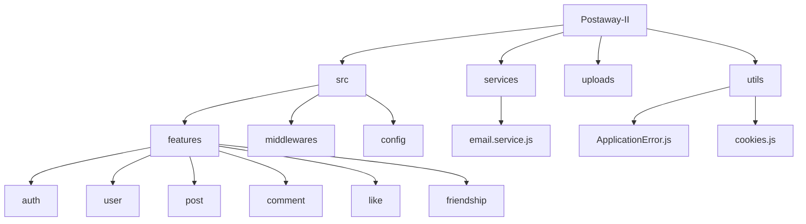
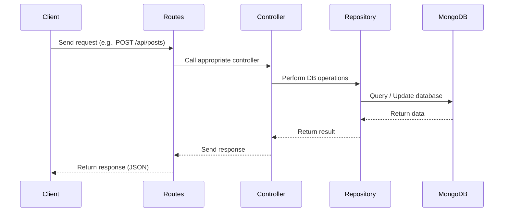

---

# 📌 Postaway-II

**Postaway-II** is a robust social media backend REST API built with **Node.js, Express.js, and MongoDB**.
It enables users to post, comment, like, manage friendships, and securely reset passwords via OTPs. The system is designed with modular architecture, repository pattern, and follows RESTful principles for scalability and maintainability.

---

## 🚀 Features

### Core Features

* 👤 **User Authentication & Management**

  * User registration & login
  * Logout & logout from all devices
  * Secure password reset via OTP
  * Profile updates with avatar uploads
* 📝 **Post Management**

  * Create, read, update, delete posts
  * Only post owners can modify or delete posts
* 💬 **Comment System**

  * Add, edit, delete, and view comments
  * Only post owners or commenters can modify/delete comments
* 👍 **Like Functionality**

  * Like/unlike posts and comments
  * Like counts and user info populated
* 🤝 **Friendship Features**

  * Send, accept, reject, cancel, and unfriend
  * Retrieve friends list and pending requests
* 🔐 **Security**

  * JWT-based authentication
  * Access & refresh tokens stored in cookies
* 📦 **File Uploads**

  * Avatar and post image uploads via Multer
* 🛑 **Error Handling**

  * Centralized error middleware with descriptive messages
* 📑 **Logging**

  * Request logging middleware for debugging and monitoring

---

## 🛠 Tech Stack

* **Backend**: Node.js, Express.js
* **Database**: MongoDB (with repository pattern)
* **Authentication & Security**: JWT, OTP via Nodemailer
* **File Uploads**: Multer
* **Error Handling**: Centralized ApplicationError class
* **Logging**: Custom logger middleware

---

## 🗂 Project Structure



```
Postaway-II/
│── src/
│   ├── feature/
│   │   ├── auth/
│   │   │   ├── auth.controller.js
│   │   │   ├── auth.model.js
│   │   │   ├── auth.repository.js
│   │   │   ├── auth.routes.js
│   │   ├── comment/
│   │   │   ├── comment.controller.js
│   │   │   ├── comment.model.js
│   │   │   ├── comment.repository.js
│   │   │   ├── comment.routes.js
│   │   ├── friendship/
│   │   │   ├── friendship.controller.js
│   │   │   ├── friendship.model.js
│   │   │   ├── friendship.repository.js
│   │   │   ├── friendship.routes.js
│   │   ├── like/
│   │   │   ├── like.controller.js
│   │   │   ├── like.model.js
│   │   │   ├── like.repository.js
│   │   │   ├── like.routes.js
│   │   ├── post/
│   │   │   ├── post.controller.js
│   │   │   ├── post.model.js
│   │   │   ├── post.repository.js
│   │   │   ├── post.routes.js
│   │   ├── user/
│   │   │   ├── user.controller.js
│   │   │   ├── user.repository.js
│   │   │   ├── user.routes.js
│   │
│   ├── middlewares/
│   │   ├── errorHandler.middleware.js
│   │   ├── jwt.middleware.js
│   │   ├── logger.middleware.js
│   │   └── multer.middleware.js
│   │   └── multer.middleware.js
│   │   └── validator.middleware.js
│   │
│   ├── utils/
│   │   └── applicationError.js
│   │   └── cookies.js
│   │
├── .gitignore
├── env.js
├── logs.txt
├── package-lock.json
├── package.json
└── README.md
└── server.js
```

---

### ⚡ API Flow Diagram



---

## ⚡ API Endpoints

### Authentication Routes (`/api/users`)

* `POST /signup` → Register a new user
* `POST /signin` → Login user
* `POST /logout` → Logout current session
* `POST /logout-all-devices` → Logout user from all devices
* `POST /refresh-token` → Generate a new access token using a valid refresh token
* `POST /send` → Send OTP for password reset
* `POST /verify` → Verify OTP
* `POST /reset-password` → Reset password after OTP verification

### User Profile Routes (`/api/users`)

* `GET /get-details/:userId` → Get user info (password excluded)
* `GET /get-all-details` → Get all users info (passwords excluded)
* `PUT /update-details/:userId` → Update user profile & avatar

### Post Routes (`/api/posts`)

* `POST /` → Create a post
* `GET /all` → Get all posts (news feed)
* `GET /:postId` → Get a specific post
* `GET /:` → Get all posts for a specific user
* `PUT /:postId` → Update a post
* `DELETE /:postId` → Delete a post

### Comment Routes (`/api/comments`)

* `GET /:postId` → Get comments for a post
* `POST /:postId` → Add comment to a post
* `PUT /:commentId` → Update a comment
* `DELETE /:commentId` → Delete a comment

### Like Routes (`/api/likes`)

* `GET /:id` → Get likes for a post/comment
* `POST /toggle/:id` → Toggle like/unlike

### Friendship Routes (`/api/friends`)

* `GET /get-friends/:userId` → Get friends list
* `GET /get-pending-requests` → Get pending friend requests
* `POST /toggle-friendship/:friendId` → Send/cancel/unfriend
* `POST /response-to-request/:friendId` → Accept/reject a request

---

## 🔐 Authentication & Security

* All routes except **signup & signin** are protected using **JWT**.
* Access & refresh tokens stored in cookies for session management.
* Password reset secured via **OTP verification**.

---

## ⚙️ Installation

```bash
# Clone repo
git clone https://github.com/codebygurpreet/Postaway-II
cd Postaway-II

# Install dependencies
npm install

# Create .env file with required configs
PORT=your_port_number
JWT_SECRET=your_secret_key
DB_URL=mongodb://localhost:27017/your_db_name
DB_NAME=your_db_name  
EMAIL_USER=your_email
EMAIL_PASS=your_email_password

# Run server
node server.js
```

---

## 🧪 Testing API

* Use **Postman / Thunder Client** to test endpoints.
* Example login response:

```json
{
  "success": true,
  "message": "Login successful",
}
```

---

## 📖 Documentation & Conventions

* **MVC & Repository Pattern**: Controller handles request/response, repository handles DB logic.
* **Error Handling**: Centralized via `ApplicationError`.
* **Pagination & Sorting**: Supported for posts & comments.
* **Ownership Validation**: Only owners can modify/delete their posts/comments.
* **Friendship Management**: Full CRUD support with pending request handling.

---

## 👨‍💻 Author

Developed by **GURPREET SINGH** ✨

---